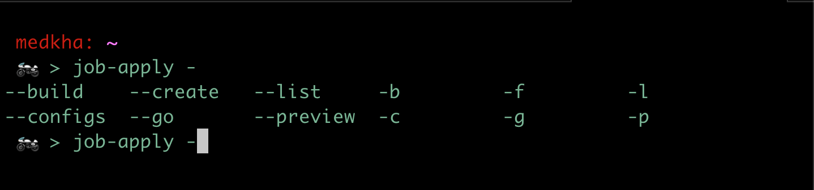
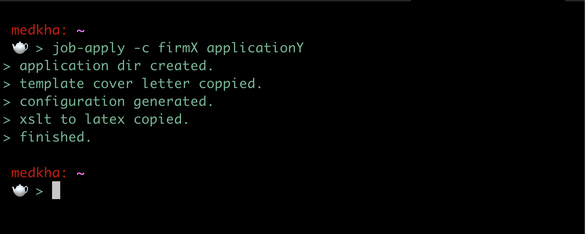
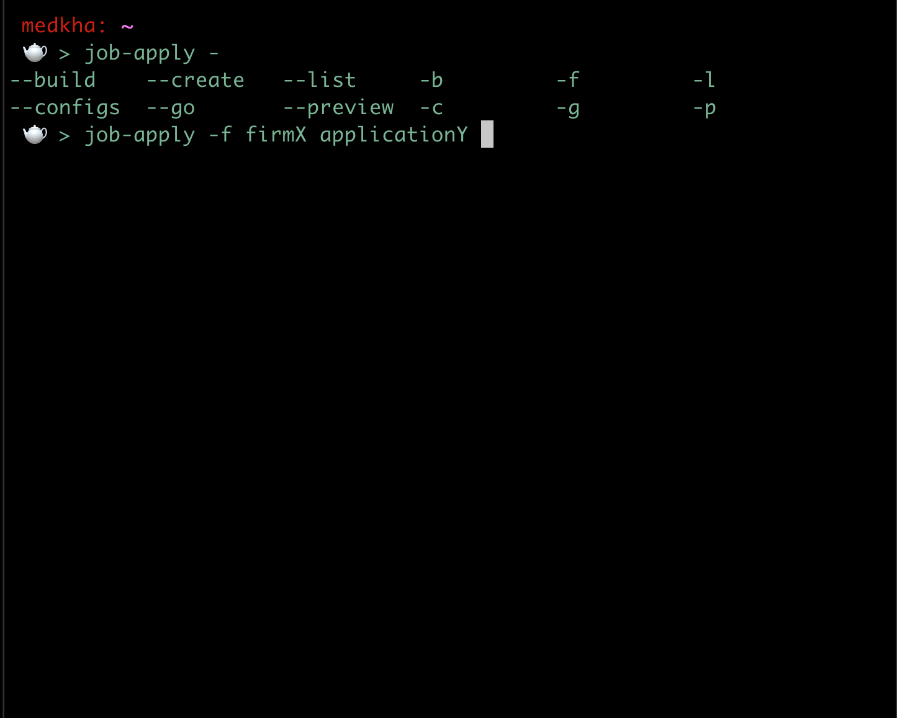
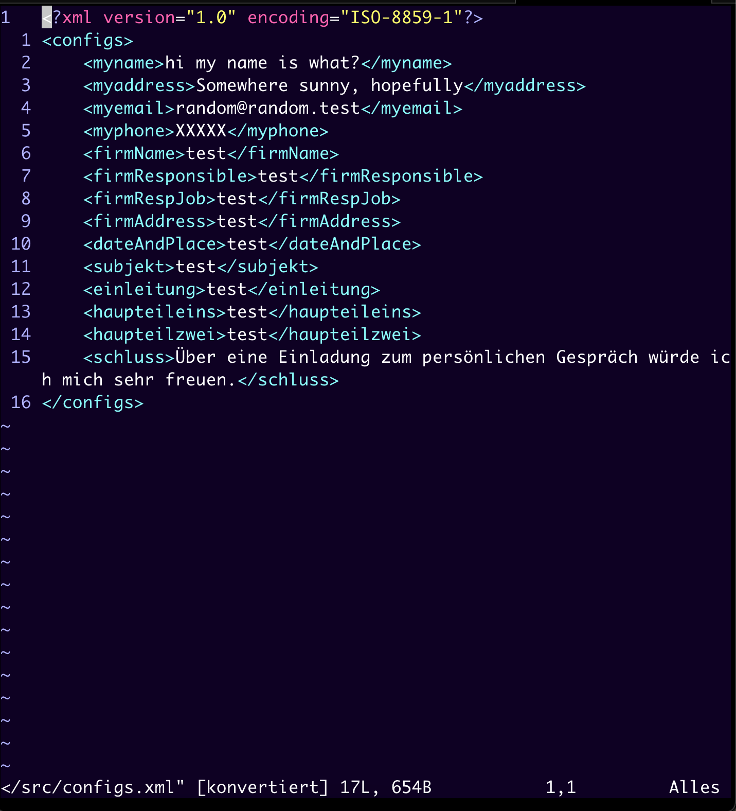
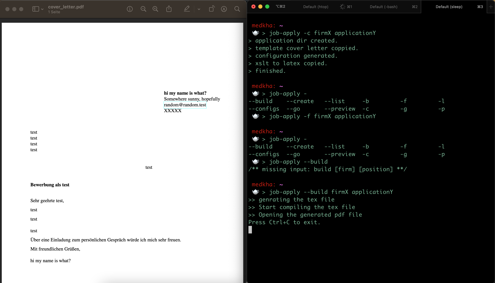

_Note: Works only in Mac for now, there are plans on making it work on popular linux distros._

## Installation 
Download the release, that should have an installation script, or clone the project which will also clone the install script 
```bash
    ./install.sh
```
Then you need to open a new bash shell.

## Problems 
For MacOs, it seems that .bashrc doesn't get sourced ( it might be just for some versions ), instead in each new bash shell (.bash_profile) is the one that is sourced. To solve the problem I add this if condition in my `$HOME/.profile` file .
```bash
if [ -n "$BASH_VERSION" ]; then 
   if [ -f "$HOME/.bashrc" ]; then
        . "$HOME/.bashrc"
    fi 
else 
fi
``` 
I could of added that in the installation script, but i don't want to mess you .bashrc file in case you already using it in a specific way.

## Usage 

type `job-apply [tab]` 
a tab stroke will show the parameters available 



### Example 
    


_Note: tab after `job-apply -c` will show the list of the aldready created firm directories_


_Note: tab after `job-apply -f` or any other param beside -c|--create  will show the list of the aldready created firm directories and after specifying the firm it will show the existing applications for that firm_


_Note: the configuration is opened on vim, to edit type `i` to save and exit `esc :wq` to exit without saving the modif `esc :q!`, i plan to give the possibilty to chose the editor for the modification_


_Note: ctrl-c will close also the pdf file._


